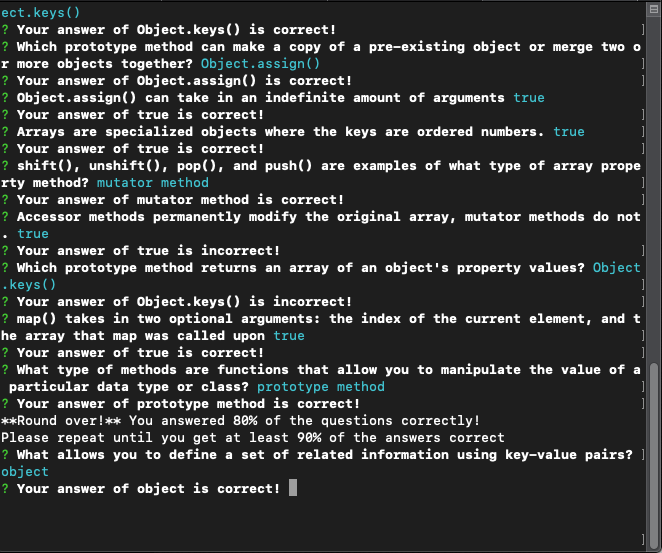

# Flashcards

**Flashcards is a multiple choice quiz playable from your terminal's command line. It is written in test-driven vanilla ES6 JavaScript.**

## Flashcards

### Gameplay:


### Round Over with score under 90%:


## Installation & Setup

**To play a round of flashcards:**

Clone [this repo](git@github.com:hannakim91/flashcards.git) into your local machine.
```
git clone git@github.com:hannakim91/flashcards-starter.git
```
Go into your local repo's Flashcards directory. Install npm, then run the index file.

```
cd [directory]
npm install
node index.js
```
Type in the corresponding number to one of the answer choices and hit enter to log your guess. Once you run through all the questions, you will receive a score indicating what percent of questions you answered correctly. 

If you score 90% or more, the game ends. If not, the program asks you to play again and restarts the questions from the beginning.

## Extra Links
* [Project Board](https://github.com/hannakim91/flashcards/projects/1)